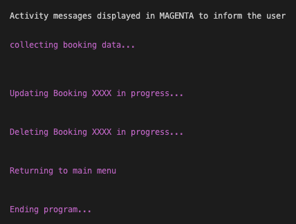

# Project Name - Kennel-Mate
* 

## View Live Project
* [Link to Deployed Project](https://kennel-mate.herokuapp.com/)

## Contents(#contents)
* [User Experience (UX)](#user-experience)
    *  [Purpose & target audience](#purpose-and-target-audience)
    *  [User Story](#user-story)
    *  [Goals](#goals)

* [Design](#design)
  * [Wireframes](#wireframes)
  * [Color Scheme](#color-scheme)
  * [Typography](#typography)
  * [Imagery](#imagery)
  * [MVP](#mvp)
  * [Planned features](#planned-features)
* [Logic](#logic)
* [Validation](#validation)
* [Technology](#technology)
* [Modules & Libraries](#modules-libraries)
* [Deployment](#deployment)
* [Testing](#testing)
  * [Tests performed](#tests-performed)
  * [User Story Tests](#user-story-tests)
  * [Bugs resolved](#bugs-resolved)
  * [Unresolved bugs](#unresolved-bugs)
  * [Improvements & future developments](#improvements-and-future-developments)
* [Forking & Cloning Instructions](#forking-cloning-instructions)
* [Credits](#credits)
  * [Code](#code)
  * [Content](#content)
  * [Media](#media)
  * [Acknowledgements](#acknowledgements)

## User Experience

   ### Purpose and target audience

   * Kennel-Mate is a simple admin booking system for a doggy daycare business, safely backed up and updated to a google cloud worksheet.
   * The sytem is designed for an employee to capture, update, delete and view booking information, including date, name, family name and amount charged, each with a unique booking number.

   ### User Story

   * The user is presented with an attractive intuitive command-line admin portal, navigating through various menu choices.
   * The user can choose to create a booking
   * The user can choose to update a booking
   * The user can choose to delete a booking
   * The user can choose to view bookings in the system
   * The user can find bookings by booking number
   * The user can find bookings by booking date
   * The user can find bookings by dog’s name or family name
   * The user will be presented with a list of relevant bookings at various points in the program, which will also include a useful count of the total bookings in the view and a total of the revenue for those bookings
   * The user will be notified when the data has been updated after each action
   * The user will be notified if they enter invalid characters, and will prompt them to reenter the information correctly

  ### Goals
   * The program should be clear and easy to use by anyone, with very little training required
   * The information displayed should be relevant to each menu item selected
   * The system should automatically generate a sequential booking number, which can be used as a unique identifier
   * The system should retrieve, add, update or delete the correct information from a Google worksheet via API calls
   * The user should easily be able to exit a menu or return to the previous menu or main menu
   * The user should be given clear instructions, within the program, if any entry or selection is invalid.

## Design

* The design is based around a terminal application that show cases Python.  The Code Institute mock terminal template was used.

* The initial menu function concept was sketched out using wireframes, a UX background designed in Canva and the logic behind the menus was created using Lucid.

   ### Wireframes  (created in [Balsamiq](https://balsamiq.cloud/))

   Desktop
   * Start Page
   * 

   * Main Menu
   * 

   * Create Booking Menu
   * 

   * Update Booking Menu
   * 

   * Delete Booking Menu
   * 

    * View Bookings Menu
   * 

   ### Color Scheme (created in [Canva](https://www.canva.com/))

   ## Main background
   * The app uses one background image which is a royalty-free template from Canva, to make the site relevant to the dog daycare industry
   * The design was initially conceived in Canva
   * 

   ## Terminal colors
   * In the terminal several font colors were chosen:
   * White for Menu items and headers
   * Yellow for anything requiring user input
   * 
   * Magenta for progress updates and displaying dynamic information such as the Bookings Counter and Revenue Total
   * 
   * Green for success messages
   * 
   * Red for invalid messages [(see validation section below)](#validation)

   ### Typography

   *  The main text font is the default font in the command line terminal
   *  The font chosen for the Kennel-Mate logo is a Google Font caled 'Geo" which was the closest font to the Canva font used
   *  Arial was used for the body font on then main page which included the Run Program button

   ### MVP

   * The minimum viable product was to have a working system, that allowed the user to create a new booking, update the information in an existing booking, delete a booking and view bookings by booking number, date, and dog's name.
   * The system also needed to handle invalid entries so as not to crash

   ### Planned features

   * The original plan was to allow the user to navigate through the system using simple, familiar menus which led them to various actions and interactions within the program.
   * The original plan was to include a unique Booking number, which was the basis for finding, upating, and deleting bookings.
   * The date, dog's name and amount charged were identified as the basic requirements.
   * As the project developed it was clear that a seperate family name was also needed in the case where there was more than one dog with the same name.  This was incorporated into the system.
   * The final system deployed all of the planned features .

## Logic

   * The system was conceived using process flow diagrams created in [Lucid](https://lucid.app/) as follows:
   * Main Menu Flow and Create Booking Logic:
   * 
   * Update Booking Menu and Logic:
   * 
   * Delete Booking Menu and Logic:
   * 
   * View Booking Menu and Logic:
   * 

## Validation
* Various validation messages were used to ensure that the user was notified correctly of any incorrect input and to ensure the program would not crash.
* * 

## Technology
* a number of tools and technology was used to complete this project:
* [Balsamiq](https://balsamiq.cloud/) - wireframes
* [Canva](https://www.canva.com/) - graphic design
* [Lucid](https://lucid.app/) - logic chart
* [Business Name Maker](https://businessnamemaker.com/) - creating a business name
* [Google Cloud Service Accounts & API](https://cloud.google.com)
* HTML - landing page
* CSS - landing page
* Python - terminal application
* [Heroku](https://www.heroku.com/)
* [HTML Validator](https://validator.w3.org/nu)
* [CSS Validator](https://jigsaw.w3.org/css-validator)
* [PEP-8 Validator](https://pep8ci.herokuapp.com/)

## Modules & Libraries
* The following libraries were imported to run the application
* os - to clear the terminal
* datetime - for date functions
* time - for date functions
* re - for regular expressions
* gspread - for google worksheet api
* tabulate - to present data in a table format
* termcolor - to present data in different colors

## Deployment
* The following steps were taken to deploy this site:
* The project was initially setup in GitHub using Code Institute's project template
* A Google worksheet was created to store the data
* An API was setup through [Google Cloud](https://cloud.google.com)
* A JSON key was created from the Service Account and copied into the repo as creds.json
* The creds.json file was added to git ignore
* The email adress in the creds.json file was shared with the Google Worksheet
* gspread was installed by typing "pip3 install gspread google-auth" in the terminal
* The live site was deployed to Heroku early on so the final UX could be experienced early and often.
* [Login to Heroku (create an account if needed)](https://id.heroku.com/login)
* Create New App - choosing a unique name
* Under Settings / Config Vars enter the PORT in the KEY section as 8000
* Add buildpacks Python and then Node.js - in that order
* 
* Under Deploy - select GitHub and link to repo name
* Under Manual Deployment, click Deploy Branch
* 

## Testing
* Extensive testing was carried out on the site which can be viewed here:
* [TESTING.md](TESTING.md)

### Bugs resolved:

  * A number of bugs were resolved including:
  * Input errors that would cause the system to crash.  these were resolved with various while loops and try except statements.
  * Google creds issue. Originally the creds were added to the project and not ignored before committing. An email from Google was received, alerting to the potential security breach.  This was resolved by creating new creds from a new service account, closing down the old service account and using git.ignore on the creds.json file.  These new creds were updated in Heroku.

### Unresolved bugs:

  * There is one Failed UX test (KOT11) where the Amount Charged is not always displayed with 2 decimal places. Due to time contraints and the fact that the Revenue Total figure is formatted correctly, and this does not affect the system performance, this was left for future development.

 ### Improvements and future developments:

  * The system could have an employee login and each booking could be linked to the employee that is logged in.
  * A data backup function would be useful so accidentlly deleted information could be retrieved.
  * Additional fields could be entered suc as the owners name and telephone number - in case of emergency etc.
  * Additional fields could be added to collect dog specific information such as dietary, medication, health conditions, behavioural observations etc.
  * Additional services could be added and revenue tracked such as meals, grooming, half day and full day rates etc.
  * As stated above the KOT11 unresolved bug could be fixed for enhanced UX.

## Forking & Cloning Instructions

* To create a copy of the repo in GitHub to edit:
1. Log in to your GitHub account.
2. Navigate to [Kennel-Mate repository](https://github.com/rstan-dev/P3-Kennel-Mate)
3. Click on the "Fork" button located in the upper right-hand corner of the repository's page.
4. Select the account where you want to fork the repository.
5. Wait for GitHub to complete the forking process.
6. Open the project in GitPod (or whichever IDE you have setup)

* To clone a copy of the repo on your local machine to edit:
1. Log in to your GitHub account.
2. Navigate to [Kennel-Mate repository](https://github.com/rstan-dev/P3-Kennel-Mate)
3. Click on the "Code" button located in the upper right-hand corner of the repository's page.
4. Click on the "HTTPS" link to copy the URL of the repository.
5. Open the terminal or command prompt on your local machine and navigate to the directory where you want to clone the repository.
6. Type the following command, replacing the "repository_URL" with the URL of the repository that you copied in step 4: git clone repository_URL
7. Press Enter and wait for the cloning process to complete.

## Credits:

  ### Code
  * All the code was written and developed entirely for this project.
  * Google Search, Stack Overflow and ChatGPT were used to clarify functions, PEP-8 requirements and docstring formats.

  ### Content
  * The system name Kennel-Mate was developoed for this project

  ### Media

  * The media used for the landing page background is royalty free

  ### Acknowledgements

  * Spencer Bariball for your mentorship
  * Code Institute's Love Sandwiches project for the Google API
  * Inspiration from Lasmina Pal's [American Pizza Order System Project](https://github.com/useriasminna/american_pizza_order_system)
  * Inspiration from  Steven Weir's [Snakes-and-Ladders Project](https://github.com/StevenWeir038/Snakes-and-Ladders)
  * Phil Ebiner & Federico Garay's [Udemy Course - Total Python](https://www.udemy.com/course/total-python)
