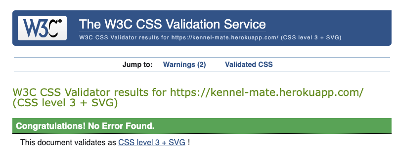
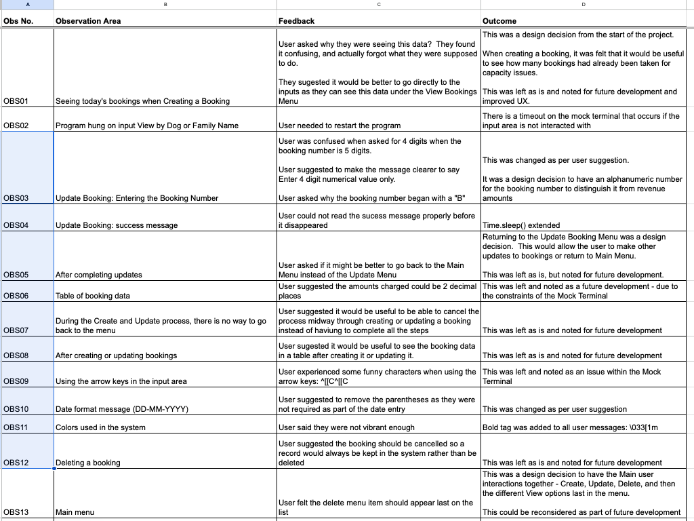

# TESTING
* The following tests were carried out on the code and the system:

## PEP-8
* After the code was written, each line of code was checked for problems and errors identified in the Problems Panel of Gitpod.
* The Problems Panel is a built-in feature of Gitpod that displays any issues or errors detected in the codebase.
* These issues included syntax errors, semantic errors and warnings similar to the below:
 
 
 

* All but 9 small issues were resolved. (5 of those were related to gitpod) The remaining were considered inconsequential to the project, and noted, but left as small bugs unresolved.
* The Pylint warning states there are 1113 lines.  Given more time the program could be refactored to fall below the recommended 1000 lines (for example the GSHEET update code could be refactored into a function), or the CRUD functions could be moved to another sheet and imported.
* It should be noted that index.js contains some commented out code.  This is part of the Code Institute project template: Total.js start script // https://www.totaljs.com. This page has not been worked on as part of the project, so it has been noted here, but left as is.
 
 
 

* Once this was completed, the code was passed through a [PEP8 Validator](https://pep8ci.herokuapp.com/) and passed.
 
 

## HTML Validation
* A small amount of HTML was used for the landing page, so validation was carried out on this code.
 
 
 

## CSS Validation
* A small amount of CSS was used for the landing page, so validation was carried out on this code.
 
 
 

* There were several warnings unrelated to the code base, so these were noted but left as is.
 
 
 

## Lighthouse Report
* This project was focused on the Terminal application and system design in Python, and less about website performance, however, a healthy Lighthouse report was generated.
 
 
 

## USER STORY TESTS
* The system was tested extensively and systematically as a user, entering information in the correct format and in various incorrect formats.
* The tests were designed around the original User Story and Goals set out at the start of the project:
 * The user is presented with an attractive intuitive command-line admin portal, navigating through various menu choices.
 * The user can choose to create a booking.
 * The user can choose to update a booking.
 * The user can choose to delete a booking.
 * The user can choose to view bookings in the system.
 * The user can find bookings by booking number.
 * The user can find bookings by booking date.
 * The user can find bookings by dog’s name.
 * The user will be presented with a list of relevant bookings at various points in the program, which will also include a useful count of the total bookings, and a total of the revenue for those bookings.
 * The user will be notified when the data has been updated after each action.

* The results were captured and failing tests were rectified until the test passed:
 

 
 
 
 
 
 
 
 
 
 
 
 
 
 
 
 
 

* There was one Failed test (see KOT11 below) which was left (and noted in unresolved bugs) as it did not impede the system's performance.
* The Amount Charged numbers displayed in the table did not always show a number with 2 decimal places. This format of the Revenue Total number was correct with 2 decimal places.
 
 
 

* [Link to View Full Test Sheet List](https://docs.google.com/spreadsheets/d/18wAAf5659X_l63eENP5EIP3J_qt7uxNIzVXvtma-cgc/edit?usp=sharing)
* [Link to View Google Worksheet with Kennel-Mate Data](https://docs.google.com/spreadsheets/d/1-GlTbADQ5tiuoQV7pvx7p1kAsNMagL4lQYM3nM3fjxI/edit?usp=sharing)

## USER STORY TESTS
* A further observation exercise was carried out using a volunteer who had never seen the system before.
* The following observations and feedback were noted, some enhancements were made due to this exercise, and others were identified for future development.
 
 

* [Link to View Full User Observation Sheet](https://docs.google.com/spreadsheets/d/18wAAf5659X_l63eENP5EIP3J_qt7uxNIzVXvtma-cgc/edit#gid=0)
